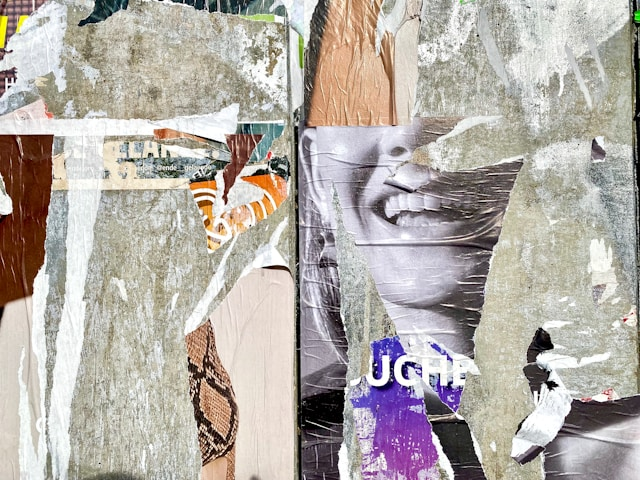

:::{.figure}
{fig-align="center"}
<p style="text-align: center; font-size: 0.8em;">
Photo by <a href="https://unsplash.com/@etiennegirardet">Etienne Girardet</a> on <a href="https://unsplash.com/">Unsplash</a>
</p>
:::

La autoría en artículos académicos no es un mero reconocimiento de participación, sino un componente clave de la ética académica y científica. Este post sintetiza criterios internacionales y reflexiones esenciales sobre lo que realmente significa firmar como autor de un trabajo académico en la era de la inteligencia artificial, con el objetivo de contribuir a delinear acciones y normas para la utilización de IA en el ámbito académico y científico. 

Asi mismo, se plantean los interrogantes básicos de utilización e implementación con el fin de ampliar la dimensión crítica con la que se aborda actualmente. Problemas como reproducción, invensión, verborragia argumentativa, entre otros, son prácticas implícitas en los distintos modelos de IA, propios de una **concatenación de datos sin autoconciencia**.

## ¿Qué es la autoría?

Según la Real Academia Española, la autoría se define comúnmente como la "cualidad de autor" y autor es la persona que es "causa de algo" [@rae_autoria]. La palabra "autor" proviene del latín auctor, -óris, que significaba 'creador', 'fuente histórica' e 'instigador'. Este término latino deriva del verbo augére ('aumentar', 'hacer progresar'), por lo que originalmente designaba a quien hacía crecer o promovía algo. La palabra se documenta en español desde 1155 [@corominas1984diccionario] y evolucionó semánticamente desde la idea de "quien hace crecer" hasta "creador de una obra". Esta misma raíz latina generó otras palabras como "autoridad", "autorizar" y "otorgar", todas relacionadas con los conceptos de origen, crecimiento y responsabilidad.

Por su parte, la palabra griega ποιητής refiere al que "crea" o "el que hace", y si esa creación es por técnica o por inspiración era el debate platónico [@platon2022ion]. Así, hasta nuestros días, ¿Qué es la autoría? o por relación ¿Qué es ser autor y cuál es la condición para ello? son problemas nodales que anteceden a IA y es necesario así reconocerlos. Sin embargo, ésta presenta nuevas dimensiones y posiblidades de análisis. 

@foucault1994autor sostiene en una de sus conferencias el 22 de febrero de 1969:

>Cómo se individualizó el autor en una cultura como la nuestra, qué estatuto se le dio, a partir de qué momento, por ejemplo, empezaron a hacerse investigaciones de autenticidad y de atribución, en qué sistema de valoración quedó atrapado, en qué momento se comenzó a contar la vida ya no de los héroes sino de los autores, cómo se instauró esa categoría fundamental de la crítica: "El hombre-y-la obra", todo esto merecería sin duda alguna ser analizado. (p. 54) 

"Qué importa quien habla, dijo alguien, qué importa quien habla" es la pregunta nodal de la argumentación que Foucault retoma de Beckett. ¿Dónde está el autor? Es difícil encontrarlo:

>En la escritura no se trata de la manifestación o de la exaltación del gesto de escribir; no se trata de la sujeción de un sujeto a un lenguaje; se trata de la apertura de un espacio en donde el sujeto escritor no deja de desaparecer. [@foucault1994autor, p. 55]

Preguntándose hasta donde llega la obra de un autor, Foucault reflexiona acertadamente. Algo, que es sumamente importante retomar hoy en día: ¿Hasta dónde llega la obra de un autor? Si media la IA, voluntaria o involuntariamente en el proceso de investigación, de escritura, de creación ¿Quién es el autor?:

>Mas supongamos que tuviéramos que ver con un autor: ¿todo lo que escribió o dijo, todo lo que dejó tras él forma parte de su obra? Problema a la vez teórico y técnico. Cuando se emprende la publicación de las obras de Nietzsche, por ejemplo, ¿en dónde hay que detenerse? Hay qué publicar todo, ciertamente, pero ¿qué quiere decir este "todo"? Todo lo que el propio Nietzschte publicó, de acuerdo. ¿Los borradores de sus obras? Ciertamente. ¿Los proyectos de aforismos? Sí. ¿También los tachones, las notas al pie de los cuadernos? Sí. Pero cuando en el interior de un cuaderno lleno de aforismos se encuentra una referencia, la indicación de una cita o de una dirección, una cuenta de la lavandería: ¿obra o no obra? ¿Y por qué no? Y esto indefinidamente. [@foucault1994autor, pp. 56-57]

**¿Obra o no obra?** ¿Es lícito utilizar IA en la escritura académica? A estas altunas, mejor dicho: ¿De qué forma es lícito utilizar IA en la escritura académica? ¿Dónde está el límite entre el autor y la colaboración? Como podemos ver, no es un problema actual sino de larga data; sin embargo, hoy día, cobra un relevancia y alcance mayor. El velo se corre y es más facil o más accesible a juicio de más sujetos cuestionar la procedencia, criticar la autenticidad, la autoría.  


## Criterios Internacionales: ICMJE y CRediT

### Los Cuatro Criterios del ICMJE

Ya en el ámbito académico, a distancia prudencial del filosófico o magistral de las conferencias de Michel Foucault, es más simple y necesario cercenar los límites de las definiciones, de los significados. Así, el International Committee of Medical Journal Editors (ICMJE) propone cuatro criterios que deben cumplirse simultáneamente para justificar la autoría [@icmje_defining]:

1. **Contribuciones sustanciales** a la concepción o diseño del trabajo; o la adquisición, análisis o interpretación de datos para el trabajo
2. **Redacción del trabajo** o revisión crítica del mismo para contenido intelectual importante
3. **Aprobación final** de la versión a ser publicada
4. **Responsabilidad** por todos los aspectos del trabajo, asegurando que las preguntas relacionadas con la precisión o integridad de cualquier parte del trabajo sean apropiadamente investigadas y resueltas

Estos criterios establecen que todos aquellos designados como autores deben cumplir los cuatro criterios para la autoría, y todos los que cumplan los cuatro criterios deben ser identificados como autores. Todos aquellos que no cumplan con los cuatro criterios no deben figurar como autores, pero sí deben ser reconocidos como colaboradores según @icmje_defining. 
Sobre el uso de IA dice específicamente el documento citado: 

>At submission, the journal should require authors to disclose whether they used artificial intelligence (AI)-assisted technologies (such as Large Language Models [LLMs], chatbots, or image creators) in the production of submitted work. Authors who use such technology should describe, in both the cover letter and the submitted work in the appropriate section if applicable, how they used it. For example, if AI was used for writing assistance, describe this in the acknowledgment section (see Section II.A.3). If AI was used for data collection, analysis, or figure generation, authors should describe this use in the methods (see Section IV.A.3.d). Chatbots (such as ChatGPT) should not be listed as authors because they cannot be responsible for the accuracy, integrity, and originality of the work, and these responsibilities are required for authorship (see Section II.A.1). Therefore, humans are responsible for any submitted material that included the use of AI-assisted technologies. Authors should carefully review and edit the result because AI can generate authoritative-sounding output that can be incorrect, incomplete, or biased. Authors should not list AI and AI-assisted technologies as an author or co-author, nor cite AI as an author. Authors should be able to assert that there is no plagiarism in their paper, including in text and images produced by the AI. Humans must ensure there is appropriate attribution of all quoted material, including full citations. [@icmje_defining]

En esto, cabe destacar dos cuestiones fundamentales:

- la razón de por qué la IA no puede ser autor es porque no cumple uno de los criterios de autoría definidos anteriormente: no es sujeto de responsabilidades.
- el uso de la IA: es pertinente que los autores declaren el uso, el tipo y la forma en la que se hizo.

Ahora, sobre el uso surgen algunos interrogantes. En tiempos en donde la IA está transformando los modelos de búsqueda [@microsoft2023], sustituyendo a los buscadores tradicionales que han dominado internet los últimos 30 años y colándose involuntariamente en los resultados de búsqueda ¿es susceptible una simple declaración? ¿Cómo se declara estar dentro de un nuevo *paradigma*? La IA ya no es optativa, o al menos para quien use medios digitales de investigación, y el uso de ella será casi indefectible. En el sentido kuhniano del término [@kuhn1970], la IA representa un cambio paradigmático en la búsqueda y procesamiento de información científica. Este nuevo *paradigma* plantea la cuestión de si es posible declarar completamente el uso de IA cuando esta se ha vuelto ubicua en los procesos de investigación digital.

### La Taxonomía CRediT

Complementando esta definición, la taxonomía CRediT es una taxonomía comunitaria de 14 roles que puede usarse para describir los tipos clave de contribuciones típicamente hechas a la producción y publicación de resultados de investigación como artículos de investigación. Esta taxonomía permite una atribución más granular de contribuciones individuales al trabajo académico [@credit_niso].

Los 14 roles de CRediT incluyen desde la conceptualización hasta la curación de datos, proporcionando un framework para reconocer diferentes tipos de contribuciones más allá de la autoría tradicional y pueden aplicarse tanto a autores como a colaboradores según la definición de @icmje_defining.

## Conceptos clave en autoría académica

La autoría en publicaciones científicas representa uno de los aspectos más complejos y controvertidos del proceso editorial, requiriendo una comprensión clara de las responsabilidades, jerarquías y prácticas éticas involucradas. Retomando lo esbozado en @icmje_defining, COPE define una serie de conceptos claves para la autoría académica [@albert_wager_2003].

### Jerarquías y orden de autores

El orden de autores transmite información crucial sobre las contribuciones relativas al trabajo de investigación. El primer autor tradicionalmente se considera quien realizó la mayor contribución y frecuentemente es el investigador principal responsable de la ejecución del estudio y la redacción inicial del manuscrito. Esta posición es particularmente valorada dado que las citas académicas típicamente se refieren a los estudios por el apellido del primer autor seguido de "et al." 

La posición del último autor presenta mayor variabilidad interpretativa entre disciplinas; comúnmente se asigna a un miembro senior del equipo que proporcionó supervisión, experiencia metodológica o recursos institucionales, aunque a menudo se sospecha que puede tratarse de autoría honoraria.

### Prácticas problemáticas en autoría

Las conductas inadecuadas relacionadas con la autoría incluyen la **autoría honoraria** (agregar a alguien que no contribuyó) y la **autoría fantasma** (omitir a alguien que sí contribuyó). Ambas prácticas quebrantan los principios de integridad científica [@codina_etica].
@albert_wager_2003 sostiene al respecto de autoría fantasma y autoría honoraria. 

**La autoría fantasma** incluye tanto a escritores profesionales (frecuentemente contratados por sponsors comerciales) cuya participación no se reconoce, como a investigadores que realizaron contribuciones significativas pero fueron omitidos de la lista de autores. Esta práctica representa un conflicto de intereses potencial y viola los principios de transparencia científica. 

**La autoría honoraria** involucra la inclusión de personas que no cumplieron los criterios ICMJE, típicamente figuras de autoridad académica o administrativa cuya inclusión busca obtener favor político o prestigio institucional. Otra variante incluye acuerdos recíprocos entre colegas para incluirse mutuamente en publicaciones independientemente de sus contribuciones reales.

### Responsabilidades y garantías

Reconociendo la creciente especialización en investigación contemporánea, las directrices ICMJE han introducido el concepto de **"garante"** - uno o más autores que asumen responsabilidad por la integridad completa del trabajo desde su concepción hasta la publicación final. Esta figura reconoce que puede ser irrazonable esperar que cada autor comprenda profundamente todos los aspectos técnicos del estudio (por ejemplo, que un radiólogo explique métodos estadísticos complejos), pero mantiene la responsabilidad general del proyecto. 

El **autor corresponsal**, aunque desempeña un rol administrativo de comunicación con editores y lectores, no debe equipararse automáticamente con jerarquía académica.

### Decisiones procesales y reconocimientos

Las decisiones sobre orden de autores requieren negociación explícita entre colaboradores, idealmente antes de iniciar la redacción del manuscrito. Algunos grupos optan por ordenamiento alfabético cuando las contribuciones son equivalentes, práctica que debe comunicarse claramente al editor. 

Las contribuciones que no ameritan autoría plena deben reconocerse apropiadamente en los **agradecimientos**, especificando la naturaleza exacta de la contribución realizada. Muchas revistas  frecuentemente requieren consentimiento firmado de las personas reconocidas en esta sección.

### Implicaciones contemporáneas

La ausencia de límites en el número de autores en bases de datos modernas ha eliminado presiones históricas para restringir las listas, pero la inclusión de múltiples autores incrementa significativamente los tiempos de preparación, revisión y finalización de manuscritos. 

La **autoría grupal** presenta desafíos particulares en la indexación de bases de datos, donde el primer nombre en listas alfabéticas puede convertirse erróneamente en primer autor por defecto. Estas consideraciones subrayan la importancia de planificación anticipada y comunicación explícita en equipos de investigación colaborativos.

### Principales nociones de autoría académica

A continuación se presenta un diagrama web realizado en HTML con el fin de sintetizar las principales ideas sobre autoría referenciadas anteriormente.

::: {#fig-authorship}

::: {.content-visible when-format="html"}
```{=html}
<iframe src="authorship_diagram_EN.html" 
        width="100%" 
        height="1200px" 
        style="border:none; border-radius:10px;">
</iframe>
```
:::

::: {.content-visible when-format="pdf"}

\begin{center}
\fbox{\parbox{0.8\textwidth}{
\centering
Interactive resource available online \\[0.5em]
View complete resource at: \\[0.3em]
\url{https://doi.org/10.5281/zenodo.15691674}
}}
\end{center}

:::
Diagram: Key Concepts in Academic Authorship. @pantaleo2025en
:::

## La Inteligencia Artificial y la Autoría

El problema de autoría relacionado específicamente con la IA profundiza cuestiones que, como se mencionó, le anteceden. ¿Hasta dónde puede contribuir la IA en un escrito académico? ¿Cómo se la reconoce? Ante el uso forzado al que estamos condicionado cada vez más con los nuevos modelos de búsqueda ¿Habría que declarar el uso o la ausencia de él?

Un análisis reciente reveló que al menos el 1% de los artículos científicos publicados en 2023 —aproximadamente 60,000 papers— mostraron signos del uso de modelos de lenguaje como ChatGPT [@stokelwalker2024chatbots; @gray2024], una cifra que según los expertos representa apenas "la punta del iceberg" de un fenómeno mucho más amplio. La evidencia de este uso va desde casos flagrantes —como la inclusión accidental de frases como "certainly, here is a possible introduction for your topic" en papers publicados por Elsevier [@stokelwalker2024chatbots]— hasta patrones más sutiles pero reveladores en el uso del lenguaje científico. Palabras como "delve" experimentaron un aumento del 654% en la base de datos PubMed entre 2020 y 2023, mientras que términos como "commendable" y "meticulous" mostraron incrementos similares [@stokelwalker2024chatbots], sugiriendo un cambio fundamental en el léxico de la escritura académica.
Esta tendencia refleja una realidad compleja en el mundo académico contemporáneo. En un contexto donde los investigadores operan bajo la presión del "publish or perish", muchos recurren a estas herramientas como asistentes de escritura o para superar barreras idiomáticas. Sin embargo, lo que comenzó como apoyo gramatical está evolucionando hacia usos más problemáticos: desde la generación de figuras científicas hasta la posible automatización del proceso de revisión por pares [@liang2024monitoring].

El fenómeno plantea interrogantes fundamentales sobre la integridad científica, especialmente considerando que estos modelos son propensos a "alucinaciones" —inventar referencias bibliográficas inexistentes— y que los detectores automáticos de contenido generado por IA resultan herramientas no confiables [@stokelwalker2024chatbots], más allá de que muchos también utilizan IA para detectar IA. Si sobre juicio se trata ¿se debe confiar sin salvadedades en una herramienta que usa IA para detectar escritura con IA?  Los siguientes gráficos (@fig-trends) extraídos de @stokelwalker2024chatbots muestran el aumento de uso de palabras claves relacionadas con la redacción realizada por IA.

{#fig-trends}

### Políticas Editoriales sobre IA

En este contexto, algunas de las principales editoriales a nivel mundial han definido criterios de uso y autoría relacionadas con la IA. A continuación se presenta una síntesis de las principales políticas editoriales:

**Cambridge University Press & Assessment** [@cambridge_ai]: Establece que las herramientas de IA deben declararse explícitamente y su uso debe explicarse detalladamente en el manuscrito. La editorial es categórica al afirmar que estas herramientas no califican para autoría debido a su incapacidad fundamental para asumir responsabilidad ética, legal y académica por el contenido producido.

**Elsevier** [@elsevier_ai]: Las herramientas de IA y tecnologías asistidas por IA no califican para autoría bajo la política de autoría de Elsevier. Los autores que utilicen estas herramientas durante el proceso de escritura del manuscrito deben declarar su uso en una sección separada del manuscrito, promoviendo la transparencia entre autores, lectores, revisores y editores.

**Springer Nature** [@springer_ai]: Los Modelos de Lenguaje Grande (LLMs), como ChatGPT, no satisfacen actualmente los criterios de autoría de la editorial. La política enfatiza que una atribución de autoría conlleva responsabilidad por el trabajo, responsabilidad que no puede aplicarse efectivamente a los LLMs. El uso de estas herramientas debe documentarse apropiadamente en la sección de Métodos o en una parte alternativa adecuada del manuscrito.

**Science Journals** [@science_ai]: Mantiene una política particularmente estricta estableciendo que el texto generado por IA, aprendizaje automático o herramientas algorítmicas similares no pueden tener atributo de autoría. La violación de esta política constituye mala conducta científica, equiparándola con otras formas de fraude académico. Explícitamente sostiene:

>Artificial intelligence (AI). AI-assisted technologies [such as large language models (LLMs), chatbots, and image creators] do not meet the Science journals’ criteria for authorship and therefore may not be listed as authors or coauthors, nor may sources cited in Science journal content be authored or coauthored by AI tools. Authors who use AI-assisted technologies as components of their research study or as aids in the writing or presentation of the manuscript should note this in the cover letter and in the acknowledgments section of the manuscript. Detailed information should be provided in the methods section: The full prompt used in the production of the work, as well as the AI tool and its version, should be disclosed. Authors are accountable for the accuracy of the work and for ensuring that there is no plagiarism. They must also ensure that all sources are appropriately cited and should carefully review the work to guard against bias that may be introduced by AI. Editors may decline to move forward with manuscripts if AI is used inappropriately. Reviewers may not use AI technology in generating or writing their reviews because this could breach the confidentiality of the manuscript. [@science_ai]

**Taylor & Francis Group** [@taylor_francis_ai]: Las herramientas de IA no pueden ser consideradas autores bajo ninguna circunstancia. La editorial requiere que los autores documenten apropiadamente cualquier uso de estas tecnologías, especificando qué herramientas fueron utilizadas y cómo contribuyeron al trabajo. Taylor & Francis Group tiene en su web también una política específica sobre IA [@taylor_francis_ai_policy] e indicaciones sobre la escritura asistida por IA [@taylor_francis_ai_writing].

**Wiley** [@wiley_ai]: Establece que la IA no puede ser autor debido a la imposibilidad de asumir las responsabilidades inherentes a la autoría. Los autores deben declarar detalladamente el uso de herramientas de IA en las secciones de Métodos o Agradecimientos, proporcionando información específica sobre cómo se utilizaron estas tecnologías en el proceso de investigación y escritura.

### Consenso sobre IA y Autoría

Las herramientas de IA no pueden cumplir los requisitos para la autoría ya que no pueden asumir responsabilidad por el trabajo enviado. Como entidades no legales, no pueden afirmar la presencia o ausencia de conflictos de interés ni manejar acuerdos de derechos de autor y licencias [@cope_ai]. Los autores que usan herramientas de IA deben ser transparentes al divulgar cómo se usó la herramienta de IA y qué herramienta se usó. Los autores son completamente responsables del contenido de su manuscrito, incluso aquellas partes producidas por una herramienta de IA.

## Mejores prácticas para la determinación de autoría en relación al uso de IA

### Acuerdos tempranos de uso

Los autores deben discutir el uso de la IA al planificar la investigación, acordar la metodología y herramienta utilizada por escrito y revisar el acuerdo durante la investigación. Es fundamental establecer estos acuerdos antes de comenzar el trabajo para evitar disputas posteriores.

### Diferenciar uso forzado del inducido

Es primordial que todo el equipo de investigación pueda diferenciar las herramientas utilizadas voluntariamente para la realización de la investigación o de la escritura, de aquellas que son inducidas por el nuevo paradigma de búsqueda web gestionada por herramientas de IA seleccionadas por los coorporaciones para mostrar resultados y no por los usuarios. 

### Declaración de uso

Actualmente, es recomendable introducir en los artículos o redacciones, una declaración de uso de IA así como comúnmente se incluyen declaraciones de conflictos de intereses, de disponibilidad de datos o financiamiento [@sampaio2024].
Acorde avanza el desarrollo de IA y la integración con los motores de búsqueda esto es primordial ya que no solo evidencia la utilización o no en alguna parte de la eleboración del artículo de algún modelo de IA sino, y sobre todo, de la conciencia del investigador en la utilización de las herramientas digitales disponibles hoy en día. 

Es primordial que las personas que redactan artículos académicos estén atentas a la diferenciación de resultados de búsqueda procesados por IA como aquellos que no lo son. Este proceso de conciencia logra evidenciar la intromisión de IA en los procesos investigativos acorde a las posibilidades del equipo de investigación de identifcarla. En caso de usos voluntarios, claro está, la definición de los alcances de usos es nodal para poder identifcar posibles falacias o invenciones en la argumentación de la investigación. Pero aún más es importante tomar conciencia de las posibles vías de intromisión de argumentaciones o resultados **artificiales** generados por búsquedas condicionadas por IA más allá de las intenciones iniciales del equipo investigador.  
De esta manera, se recomienda no sólo indicar cuándo y cómo se usa un modelo de IA, sino también cuando no se usa en una investigación. Siguiendo la declaración sugerida en @sampaio2024:

> Durante a preparação deste trabalho, o(s) autor(es) utilizou(aram) [nome da ferramenta/modelo ou serviço] versão [número e/ou data] para [justificar o motivo]. Após o uso desta ferramenta/modelo/ serviço, o(s) autor(es) revisou(aram) e editou(aram) o conteúdo em conformidade com o método científico e assume(m) total responsabilidade pelo conteúdo da publicação. (p. 20)

Bien podría declararse también cuando no se usa: "En en el presente trabajo no se han utilizado modelos de IA en ni una de sus fases."

## Conclusión

Firmar un artículo no es una formalidad ni una cortesía, es una declaración ética que conlleva responsabilidades legales e intelectuales. La adopción de los marcos del ICMJE y CRediT, junto con políticas claras sobre el uso de IA, asegura el reconocimiento justo de contribuciones reales y ayuda a prevenir conductas inadecuadas que socavan la confianza científica.

En la era de la inteligencia artificial, es fundamental mantener que la autoría requiere responsabilidad humana, transparencia en el uso de herramientas de IA, y adherencia a criterios éticos establecidos. La evolución hacia una mayor colaboración multidisciplinaria y el uso responsable de tecnologías emergentes debe ir acompañada de marcos éticos robustos que protejan la integridad de la investigación científica.

Como señala Michel Foucault, hay discursos que están provistos de autoría y otros no. Esto, se contruye al interior de una sociedad, de una cultura, de un discurso y es validado por quienes comparten las mismas pautas argumentativas: 

>Se llegará finalmente a la idea de que el nombre de autor no va, como el nombre propio, del interior de un discurso al individuo real y exterior que lo produjo, sino que corre, en cierto modo, en el límite de los textos, los recorta, sigue sus aristas, manifiesta su modo de ser o, al menos, lo caracteriza. Manifiesta el acontecimiento de un cierto conjunto del discurso, y se refiere al estatuto de este discurso en el interior de una sociedad y en el interior de una cultura. El nombre de autor no se sitúa en el estado civil de los hombres, ni se sitúa tampoco en la ficción de la obra, se sitúa en la ruptura que instaura un cierto grupo del discurso y su modo de ser singular. Podría decirse, por consiguiente, que en una civilización como la nuestra hay un cierto número de discursos dotados de la función de "autor" mientras que otros están desprovistos de ella. Una carta privada puede muy bien tener un signatario, pero no tiene autor; un contrato puede tener un fiador, pero no tiene autor. Un texto anónimo que se lee en la calle sobre un muro tendrá un redactor, pero no tendrá un autor. La función autor es, entonces, característica del modo de existencia, de circulación y de funcionamiento de ciertos discursos en el interior de una sociedad. [@foucault1994autor, pp. 60-61]

Podría concluirse que la IA como tal, está desprovista de autoría porque no es resposable ni consciente de su propio acto creativo, es una excelente herramienta. Como tal, su uso por parte de sujetos es lo que significa un acto ético. Puede usarse éticamente para enriquecer y desarrollar nuevos modelos argumentativos o puede utilizarse para desarrollar texto sin cuidado humano alguno. En todo caso, el acto responsable de la conciencia humana es lo que determina la autoría.

::: {.callout-note title="Nota 1"}
En la redacción de este post ha intervenido IA en la escritura de párrafos, en la síntesis de ideas, en el resumen de bibliografía y en el armado de metadatos y texto en MD, YAML y BibTeX. También ha respondido las consultas y solicitudes que el autor ha realizado para ampliar la crítica y mejorar la sintaxis. La asistencia de IA fue proporcionada por Claude Sonnet 4 (Anthropic).
:::

::: {.callout-note title="Nota 2"}
Las traducciones son propias del autor procesadas mediante Claude Sonnet 4 (Anthropic). Mayoritariamente se ha tomado bibliografía en español y traducido la misma al inglés. Algunas de ellas se mantienen en idioma original de la bibliografía. 
:::